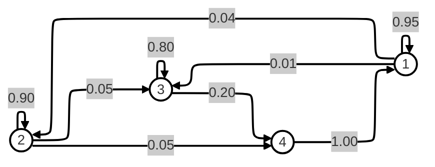

# 🧮 TI301I – Study of Markov Graphs (Part 1)

## 📘 Overview

This project is part of the **Algorithms and Data Structures 2 (TI301I)** course, and aims to implement the **representation and verification of Markov graphs** using **adjacency lists** in C.

A **Markov graph** is a directed graph where:
- Each vertex represents a *state*.
- Each edge carries a *probability* of transition between two states.
- The sum of all outgoing probabilities from any vertex must equal **1** (Markov constraint).

---

## 🎯 Objectives

1. **Read and construct** a graph from a text file (`data/input.txt`).
2. **Store** the graph as an adjacency list.
3. **Display** the graph structure in console form.
4. **Verify** that the graph satisfies the *Markov property*.
5. **Export** the graph to a **Mermaid format (.mmd)** for visualisation.
6. **Handle errors and free memory** correctly.

---

## 📂 Project Structure

```
.
├── CMakeLists.txt
├── include/
│   ├── adj_list.h
│   ├── markov_check.h
│   └── export_mermaid.h
├── src/
│   ├── main.c
│   ├── adj_list.c
│   ├── markov_check.c
│   └── export_mermaid.c
├── data/
│   ├── valid.txt
│   ├── invalid.txt
│   └── borderline.txt
├── output/
│   └── graph_output.mmd
└── README.md
```

---

## 👥 Work Distribution (Group of 4)

Check `Plan-Part1-PRJ`

---

## ⚙️ Compilation & Execution

### 1️⃣ Configure the CMake project
Ensure the `CMakeLists.txt` file defines:
```cmake
add_executable(graph_part1
    src/main.c
    src/adj_list.c
    src/markov_check.c
    src/export_mermaid.c
)
target_include_directories(graph_part1 PRIVATE include)
```

### 2️⃣ Build and run
In CLion or terminal:
```bash
mkdir build && cd build
cmake ..
make
./graph_part1
```

### 3️⃣ Example input
`data/example.txt`:
```
4
1 1 0.95
1 2 0.04
1 3 0.01
2 2 0.9
2 3 0.05
2 4 0.05
3 3 0.8
3 4 0.2
4 1 1
```

### 4️⃣ Expected output
```
Vertex 1 -> (1,0.95) (2,0.04) (3,0.01)
Vertex 2 -> (2,0.90) (3,0.05) (4,0.05)
Vertex 3 -> (3,0.80) (4,0.20)
Vertex 4 -> (1,1.00)

✅ The graph is a Markov graph
```

---

## 🧠 Markov Verification Logic

For each vertex *i*:
```c
float sum = 0;
for each edge e in list[i]:
    sum += e->proba;

if (sum < 0.99 || sum > 1.00)
    report "Vertex i invalid, sum = %f"
```

If all sums ∈ [0.99, 1.00] → Graph is valid ✅

---

## 🌐 Mermaid Export

If the graph is valid, a `.mmd` file is generated for Mermaid:



File path (example): `output/graph_output.mmd`

---

## 🧪 Validation Checklist

- [x] Load graph from `.txt`
- [x] Display adjacency list
- [x] Verify Markov constraint
- [x] Export valid `.mmd` file
- [x] No warnings or memory leaks
- [x] Tested with `valid.txt`, `invalid.txt`, `borderline.txt`

---

## 🧰 Return Codes

| Code | Meaning              |
|------|----------------------|
| `0`  | Success              |
| `1`  | Non-Markov graph     |
| `2`  | File or memory error |

---

## 🧼 Final Deliverables

- Source code (`main.c`, `adj_list.c`, `markov_check.c`, `export_mermaid.c`)
- Headers (`.h`)
- Sample data files
- Generated `.mmd` file
- This `README.md`
- Clean compilation (`-Wall -Wextra -pedantic` → no warnings)
